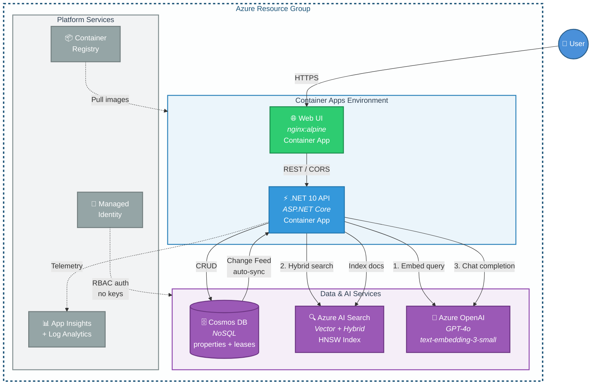
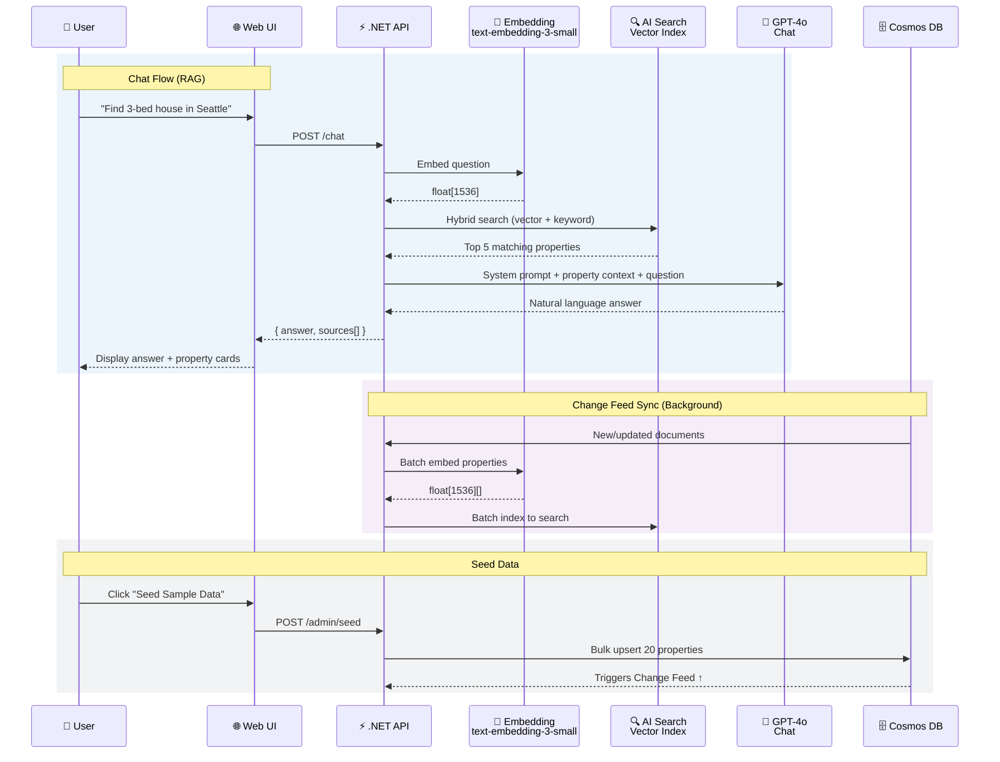

# Classic RAG — Real Estate Assistant

A complete end-to-end **Retrieval-Augmented Generation (RAG)** template built with **.NET 10**, **Azure Cosmos DB**, **Azure AI Search**, and **Azure OpenAI**, deployed to **Azure Container Apps** using the Azure Developer CLI (`azd`).

## Architecture

### Infrastructure Overview



### Request Flow & Data Sync



## What's Included

| Component | Description |
|---|---|
| **Cosmos DB** | Stores real estate property listings with autoscale throughput and change feed enabled |
| **Azure AI Search** | Vector + hybrid search index with HNSW algorithm for semantic retrieval |
| **Azure OpenAI** | `gpt-4o` for chat completions, `text-embedding-3-small` for vectorization |
| **Container Apps (API)** | Hosts the .NET 10 API with managed scaling (1–3 replicas) |
| **Container Apps (Web)** | Hosts the chat UI via nginx with managed scaling (1–2 replicas) |
| **Managed Identity** | Passwordless RBAC authentication to all Azure services |
| **Change Feed Processor** | Background service that automatically indexes new/updated Cosmos DB documents into AI Search |
| **Bicep Infrastructure** | Modular IaC for all resources — provision and tear down with a single command |

## How It Works

1. **Seed** — `POST /admin/seed` loads 20 sample real estate listings into Cosmos DB
2. **Change Feed** — A `BackgroundService` watches for new/updated documents, generates embeddings, and indexes them into Azure AI Search automatically
3. **Chat (RAG)** — `POST /chat` embeds the user's question → performs hybrid vector + keyword search → builds context from top results → calls GPT-4o → returns an answer with source property cards
4. **Bulk Reindex** — `POST /admin/reindex` reads all Cosmos DB documents, batch-embeds them, and pushes to the search index

## Prerequisites

- [Azure Developer CLI (azd)](https://aka.ms/azd-install)
- [.NET 10 SDK](https://dotnet.microsoft.com/download/dotnet/10.0)
- [Docker Desktop](https://www.docker.com/products/docker-desktop)
- An Azure subscription with access to Azure OpenAI

## Quick Start

```bash
# Clone and navigate to the project
cd RAG

# Authenticate with Azure
azd auth login

# Provision infrastructure and deploy (select your subscription & region)
azd up

# After deployment completes, open the Web URL (SERVICE_WEB_URI) printed in the output
# Click "Seed Sample Data" in the chat UI to load sample listings
# Start chatting! Try: "Find me a 3-bedroom house in Seattle under $900K"
```

## Tear Down

```bash
azd down
```

This removes all Azure resources created by the template.

## Project Structure

```
ClassicRag/
├── azure.yaml                          # azd service definitions (api + web)
├── infra/
│   ├── main.bicep                      # Orchestrates all modules
│   ├── main.parameters.bicepparam      # Environment parameters
│   ├── identity.bicep                  # User-assigned managed identity
│   ├── cosmos.bicep                    # Cosmos DB account, database, containers
│   ├── search.bicep                    # Azure AI Search service + RBAC
│   ├── openai.bicep                    # Azure OpenAI + model deployments
│   ├── registry.bicep                  # Container Registry
│   ├── app.bicep                       # API Container App + environment
│   ├── web.bicep                       # Web frontend Container App
│   ├── monitoring.bicep                # Log Analytics + Application Insights
│   └── abbreviations.json             # Resource naming prefixes
└── src/
    ├── Api/
    │   ├── Program.cs                  # Service registration, CORS & middleware
    │   ├── Dockerfile                  # Multi-stage .NET 10 build
    │   ├── Models/
    │   │   ├── RealEstateProperty.cs   # Property data model (20 fields)
    │   │   └── ChatModels.cs           # Chat request/response DTOs
    │   ├── Services/
    │   │   ├── CosmosDbService.cs      # CRUD + bulk operations
    │   │   ├── EmbeddingService.cs     # Batched OpenAI embeddings
    │   │   ├── SearchIndexService.cs   # Index management + hybrid search
    │   │   ├── ChangeFeedService.cs    # Auto-sync Cosmos → Search
    │   │   └── RagService.cs           # Retrieve → Augment → Generate
    │   └── Endpoints/
    │       ├── ChatEndpoints.cs        # POST /chat
    │       ├── PropertyEndpoints.cs    # CRUD /properties
    │       └── AdminEndpoints.cs       # POST /admin/seed, /admin/reindex
    └── Web/
        ├── index.html                  # Chat UI (single-page app)
        ├── nginx.conf                  # nginx server config
        ├── startup.sh                  # Injects API_BASE_URL into config.json
        └── Dockerfile                  # nginx:alpine image
```

## API Endpoints

| Method | Path | Description |
|---|---|---|
| `POST` | `/chat` | Ask a question about properties (RAG) |
| `GET` | `/properties` | List properties (optional `?city=` filter) |
| `GET` | `/properties/{id}?city=` | Get a single property |
| `POST` | `/properties` | Create a property |
| `PUT` | `/properties/{id}` | Update a property |
| `DELETE` | `/properties/{id}?city=` | Delete a property (from Cosmos DB + Search) |
| `POST` | `/admin/seed` | Seed 20 sample listings |
| `POST` | `/admin/reindex` | Bulk reindex all properties to Search |
| `GET` | `/health` | Health check |

## Sample Questions

- "Find me a 3-bedroom house in Seattle under $900K"
- "What luxury condos are available with waterfront views?"
- "Show me properties in Austin with a pool"
- "Compare the townhouses in Nashville and Denver"
- "What's the most affordable starter home?"
- "Find properties built after 2020 with modern design"

## Key Design Decisions

- **Partition key**: `/city` — optimized for location-based queries (high cardinality, aligns with common access patterns)
- **Separate frontend/API**: Web UI (nginx) and .NET API are independently scalable Container Apps; API_BASE_URL is injected at startup
- **Change feed**: All-versions mode ensures no document changes are missed; the processor runs as a `BackgroundService` within the API container
- **Hybrid search**: Combines vector similarity (HNSW) with keyword search for better retrieval quality
- **Singleton clients**: `CosmosClient`, `SearchIndexClient`, and `AzureOpenAIClient` are registered as singletons per SDK best practices
- **Managed Identity**: No secrets stored anywhere — all auth via `DefaultAzureCredential` with user-assigned managed identity

## Security

All resources enforce managed identity with local/key-based authentication fully disabled:

| Resource | Setting | Effect |
|---|---|---|
| **Cosmos DB** | `disableLocalAuth: true` | Primary/secondary keys rejected; only RBAC works |
| **Azure AI Search** | `disableLocalAuth: true` | API keys disabled; only RBAC works |
| **Azure OpenAI** | `disableLocalAuth: true` | API keys disabled; only RBAC works |
| **Container Registry** | `adminUserEnabled: false` | No admin password; image pulls via AcrPull role only |

RBAC roles assigned to the managed identity:

| Role | Resource | Purpose |
|---|---|---|
| Cosmos DB Built-in Data Contributor | Cosmos DB | Read/write documents |
| Search Index Data Contributor | AI Search | Read/write index data |
| Search Service Contributor | AI Search | Manage indexes |
| Cognitive Services OpenAI User | Azure OpenAI | Call chat and embedding models |
| AcrPull | Container Registry | Pull container images |
